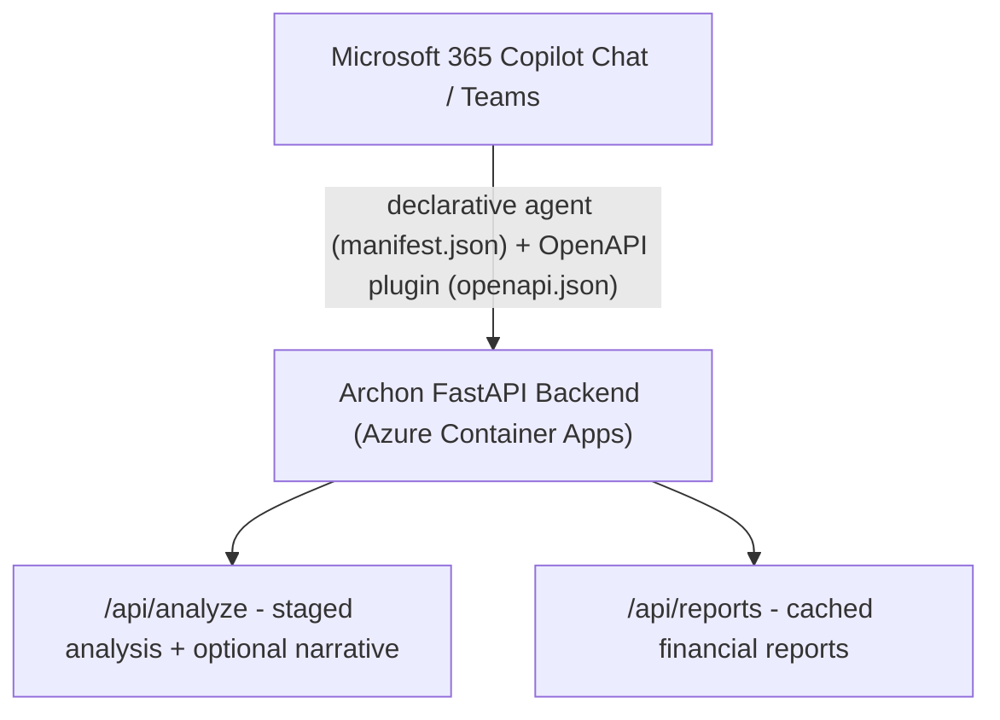
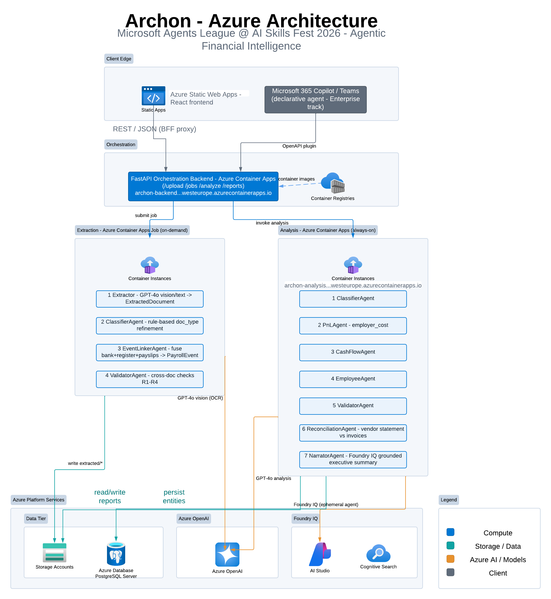

# Archon — Automated Business P&L Intelligence (Azure)

> **Built for Microsoft's Agents League hackathon at AI Skills Fest**

Archon (Αρχων — "ruler/chief") is a prototype for turning business documents into reviewable, P&L-style analysis. It combines model-assisted extraction with deterministic classification, aggregation, validation and reconciliation stages. An optional narration path can use Azure OpenAI and Microsoft Foundry Agent Service (classic).

[](https://github.com/upgradedev/archon_azure/actions/workflows/smoke-test.yml)
[](LICENSE)
[](https://gentle-sky-08574a603.7.azurestaticapps.net)
[](https://youtu.be/NanSqsQMTBg)
[](docs/JUDGE-GUIDE.md#test-coverage)
[](frontend/e2e/dashboard.spec.ts)
[](docs/JUDGE-GUIDE.md)

---

## The Core Insight — Cost Is Not Cash

A payroll period can be represented by several records that answer different questions:

| Document stream | What it shows | What it misses |
|---|---|---|
| Bank confirmation | Net cash transferred to employee accounts | Employer social-insurance contribution (separate institutional transfer) |
| Payroll register | Full gross wages + employer contribution (true cost) | Actual cash flow timing |
| Individual payslips | Per-employee gross/net/deduction breakdown | Aggregate employer cost |

The extraction job's **EventLinkerAgent** groups bank confirmations, payroll registers and payslips by company and period, then runs four consistency checks over those extraction-time groups. Completeness records the presence of those three implemented document types; it is not audited relationship-level matching, and tax-authority records are not linked. The separate analysis service does not consume those linked-event artifacts. Its current P&L deduplication is a coarser period-level prototype rule: if any payroll register is present, every bank confirmation and payslip in that period is excluded from the expense total.

That distinction matters. A payroll register can represent employer cost while a bank confirmation represents a cash transfer. The prototype keeps those views separate, but it does not reconstruct a complete payroll or cash ledger.

---

## Optional grounded narration

When configured, Archon's **NarratorAgent** uses the Threads, Messages and Runs implementation of **Microsoft Foundry Agent Service (classic)** through `azure-ai-projects==1.0.0b10`. It can attach an `AzureAISearchTool` to retrieve context before producing the downstream summary:


This path is optional and non-blocking. If a Foundry connection is unavailable, the code falls back to Azure OpenAI Chat Completions. That fallback is grounded only when Azure AI Search endpoint and key settings are also present; local and CI runs must not be assumed to produce grounded or cited narration.

---

## Enterprise Agents Track — Microsoft 365 Copilot Integration

The `m365-agent/` directory contains a **Microsoft 365 Copilot declarative-agent package** and OpenAPI plugin as a separate integration path:



**Conversation starters available in Teams:**
- *"What was our P&L for January 2026?"*
- *"What is our true payroll cost including IKA contributions?"*
- *"Give me an executive summary of our financial health"*

See [`m365-agent/README.md`](m365-agent/README.md) for deployment steps.

---

## Architecture



---

## Agent Responsibilities

### Extraction Job (Azure Container Apps Job)

| Agent | Responsibility |
|---|---|
| **Extractor** | Handle PDF, DOCX and common image formats; call GPT-4o vision or text; produce ExtractedDocument per file |
| **ClassifierAgent** | Rule-based doc_type refinement — no LLM; distinguishes payroll_register / bank_confirmation / payslip |
| **EventLinkerAgent** | Group payroll docs by company + period; produce PayrollEvent linking all three subtypes |
| **ValidatorAgent** | Cross-document consistency (R1 bank≈payslips ±2%, R2 social-security ratio, R3 payment date, R4 employee count) |

### Analysis Endpoint (Azure Container Apps — always-on)

| Agent | Responsibility |
|---|---|
| **ClassifierAgent** | Re-classify for analysis context |
| **PnLAgent** | P&L-style aggregation — uses `employer_cost_total` when present and a coarse period-level payroll deduplication rule |
| **CashFlowAgent** | Cash-flow proxy — treats bank confirmations as outflows and assumes sales are collected and invoice/expense documents are paid |
| **EmployeeAgent** | Per-employee salary analytics from payslips; payroll event summaries |
| **ReconciliationAgent** | Vendor statement vs uploaded invoices — surfaces missing documents |
| **ValidatorAgent** | Re-runs period-level consistency checks over the loaded documents |
| **NarratorAgent** | Optional downstream summary through Microsoft Foundry Agent Service (classic) or an Azure OpenAI fallback |

### Current prototype boundaries

- The reliable live-extraction formats are **PDF, DOCX and common image formats**. The upload route also accepts legacy `.doc`, but `python-docx` is not a reliable binary `.doc` parser; this remains a repository defect.
- Live extraction does not populate the dedicated payroll or statement fields used by the richer analysis. Those demonstrations use pre-structured synthetic records.
- The analysis service loads only `documents.json`. It independently reclassifies and validates documents and does not consume extraction-time `events.json` or `validation.json`, so those stored artifacts can go stale after document review.
- The UI exposes a document review step, but it is not an enforced backend approval gate. Review fetch or save errors can continue to analysis, and report generation is not gated on an approval record.
- Raw uploads remain in Blob Storage when extraction fails. The failure is logged, but no dedicated exception record is written.
- PostgreSQL is provisioned and a schema is present, but the inspected application path does not query it.

---

## Quickstart (Local Dev)

```bash
# Prerequisites: Docker Desktop, Python 3.12+

git clone https://github.com/upgradedev/archon_azure
cd archon_azure

cp .env.example .env
# Fill in: AZURE_OPENAI_ENDPOINT, AZURE_OPENAI_API_KEY
# Local dev uses Azurite (blob emulator) — no real Azure storage needed

docker compose up --build
```

Open http://localhost:3000

Generate synthetic sample documents:
```bash
pip install reportlab
python scripts/generate-sample-data.py
```

Seed demo extracted documents (bypasses extraction job for demo):
```bash
pip install azure-storage-blob
python scripts/upload_demo_docs.py
```

Run the seeded analysis smoke test (this bypasses live extraction):
```bash
CI_SKIP_EXTRACTION=1 bash scripts/test-pipeline.sh
```

---

## Deploy to Azure

### Repository-defined infrastructure (Bicep plus existing/manual dependencies)

```bash
az group create --name archon-rg --location westeurope

az deployment group create \
  --resource-group archon-rg \
  --template-file infra/main.bicep \
  --parameters postgresAdminPassword=<your-password>
```

`infra/main.bicep` provisions the core storage, compute, search, OpenAI, PostgreSQL, Key Vault and monitoring resources. The Microsoft Foundry hub/project and Search connection are referenced as existing resources, and the analysis identity's required project-scope Contributor assignment is documented as a manual step. Deployment therefore is not fully self-contained in Bicep.

### Build and push images

```bash
ACR=$(az acr show -n <your-acr> --query loginServer -o tsv)

# Extraction job
cd jobs/extraction
docker build -t $ACR/archon-extraction:latest .
docker push $ACR/archon-extraction:latest

# Analysis endpoint
cd ../../endpoints/analysis
docker build -t $ACR/archon-analysis:latest .
docker push $ACR/archon-analysis:latest
```

### Apply PostgreSQL schema

```bash
psql "$DATABASE_URL" -f backend/db/schema.sql
```

### Seed the optional Azure AI Search knowledge index

Upload accounting standards documents to Azure AI Search index `archon-knowledge`:
- IFRS/IAS standards summaries (PDFs or chunked text)
- Payroll & social-security contribution rate tables
- VAT / indirect-tax reverse-charge provisions

Use the Azure AI Search portal or the REST API to upload and index these documents. The Azure OpenAI fallback can query the index when `AZURE_AI_SEARCH_ENDPOINT` and `AZURE_AI_SEARCH_KEY` are set. The classic Agent Service path instead requires the existing Foundry Search connection named by `AZURE_AI_SEARCH_CONNECTION_NAME`.

### Frontend (Azure Static Web Apps)

```bash
cd frontend
npm install && npm run build
az staticwebapp create --name archon-frontend --resource-group archon-rg \
  --source https://github.com/upgradedev/archon_azure --branch master \
  --app-location frontend --output-location dist
```

---

## Estimated Cost (demo scale)

| Service | Estimate |
|---|---|
| Azure Static Web Apps | Free |
| Azure Container Apps (backend) | ~$15–20/mo |
| Azure Container Apps (analysis) | ~$25–30/mo |
| Azure Container Apps Job (extraction) | ~$0.10 per run |
| Azure Blob Storage | ~$0.01/mo |
| Azure Database for PostgreSQL (Burstable B2ms) | ~$30/mo |
| Azure OpenAI (GPT-4o) | ~$0.005 per 1K tokens |
| Azure AI Search (Basic) | ~$75/mo |

---

## Cloud Portability

The code separates job orchestration and object storage behind provider-specific settings, but portability to AWS or GCP is an architectural mapping and future integration task, not a verified switch-by-environment-variable capability.

| Component | Azure | AWS | GCP |
|---|---|---|---|
| Batch Job | Container Apps Job | Batch | Cloud Run Jobs |
| Endpoint | Container Apps | ECS | Cloud Run |
| Storage | Blob Storage | S3 | GCS |
| Database | PostgreSQL Flexible | RDS | Cloud SQL |
| LLM | Azure OpenAI | Bedrock | Vertex AI |

---

## Submission Details

- **Contest:** Microsoft Agents League @ AI Skills Fest 2026
- **Tracks:** Reasoning Agents (Microsoft Foundry) · Enterprise Agents (Microsoft 365 Copilot)
- **Optional narration:** Microsoft Foundry Agent Service (classic) with `AzureAISearchTool` when configured
- **Live demo:** https://gentle-sky-08574a603.7.azurestaticapps.net
- **Demo video:** https://youtu.be/NanSqsQMTBg
- **Backend health:** https://archon-backend.politemeadow-da83e97d.westeurope.azurecontainerapps.io/health
- **Judge evidence guide:** [docs/JUDGE-GUIDE.md](docs/JUDGE-GUIDE.md)
- **Architecture diagram:** [docs/architecture.svg](docs/architecture.svg)
- **License:** MIT
- **Author:** Efthymios Fousekis (tf@upgrade.net.gr)
