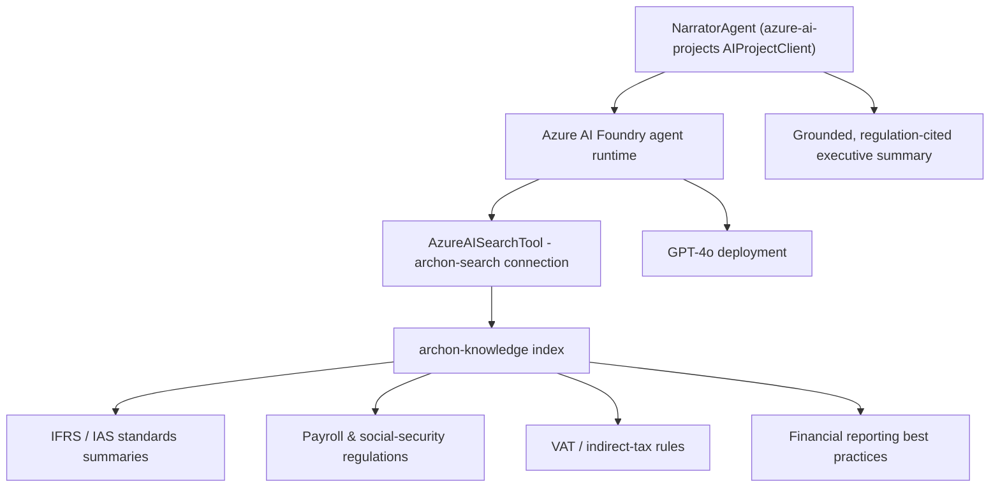
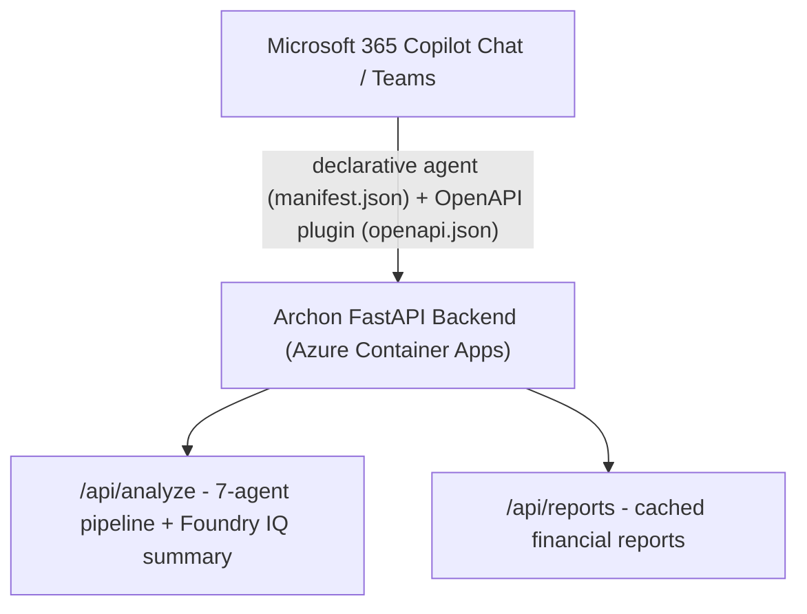

# Archon — Automated Business P&L Intelligence (Azure)

> **Microsoft Agents League Contest @ AI Skills Fest 2026**
> Tracks: **Reasoning Agents** + **Enterprise Agents** · Microsoft IQ: **Foundry IQ**

Archon (Αρχων — "ruler/chief") is an agentic financial intelligence platform for small and medium businesses. It ingests raw business documents — in multiple languages, scanned or digital — and produces a boardroom-ready P&L dashboard with regulation-cited executive summaries powered by Azure OpenAI and **Foundry IQ**.

[](https://github.com/upgradedev/archon_azure/actions)
[](LICENSE)
[](https://gentle-sky-08574a603.7.azurestaticapps.net)
[](https://youtu.be/NanSqsQMTBg)
[](jobs/extraction/tests)
[](docs/JUDGE-GUIDE.md)

---

## The Core Insight — The Multi-Stream Payroll Problem

A single payroll period cannot be understood from any one document. Each document type captures a different, non-overlapping slice of the truth:

| Document stream | What it shows | What it misses |
|---|---|---|
| Bank confirmation | Net cash transferred to employee accounts | Employer social-insurance contribution (separate institutional transfer) |
| Payroll register | Full gross wages + employer contribution (true cost) | Actual cash flow timing |
| Individual payslips | Per-employee gross/net/deduction breakdown | Aggregate employer cost |
| Tax authority records | Income-tax withholdings remitted | Salary structure |

These are **four separate payment streams** to four different counterparties. They cannot be matched by date, amount, or counterparty — they require correlation by company, period, and regulatory logic (social-security contributions under payroll regulations, income-tax withholdings under tax-authority rules).

Without correlating all streams, an SMB reading only the bank statement systematically **understates payroll expense** and overstates profit — because the bank shows only the employee net transfer, not the employer's social-security contribution or the tax-authority remittance.

Archon's **EventLinkerAgent** performs this correlation automatically, fusing all four streams into a single accurate payroll event per period.

---

## Microsoft IQ Integration — Foundry IQ

Archon's **NarratorAgent** uses **Foundry IQ** via the **azure-ai-projects SDK** — the native Azure AI Foundry agent runtime — to ground its executive summaries in cited, authoritative sources:



**Why Foundry IQ matters here:** Financial AI without grounding hallucinates regulatory figures. When the NarratorAgent states "employer costs include social-security contributions at 26.67% of gross wages per payroll regulations," that claim is retrieved from the knowledge index and cited — not generated from training data alone.

The narrator uses the **azure-ai-projects** SDK (`AIProjectClient.from_connection_string` → `create_agent` → `AzureAISearchTool`) — the actual Foundry agent framework, not just Azure OpenAI with `extra_body`. A graceful fallback path (Azure OpenAI On Your Data) covers local dev and CI.

---

## Enterprise Agents Track — Microsoft 365 Copilot Integration

Archon is also submitted in the **Enterprise Agents** track. The `m365-agent/` directory contains a **Microsoft 365 Copilot declarative agent** that brings Archon into Teams and Copilot Chat:



**Conversation starters available in Teams:**
- *"What was our P&L for January 2026?"*
- *"What is our true payroll cost including social-security contributions?"*
- *"Give me an executive summary of our financial health"*

See [`m365-agent/README.md`](m365-agent/README.md) for deployment steps.

---

## Architecture


---

## Agent Responsibilities

### Extraction Job (Azure Container Apps Job)

| Agent | Responsibility |
|---|---|
| **Extractor** | Auto-detect file type; call GPT-4o vision or text; produce ExtractedDocument per file |
| **ClassifierAgent** | Rule-based doc_type refinement — no LLM; distinguishes payroll_register / bank_confirmation / payslip |
| **EventLinkerAgent** | Group payroll docs by company + period; produce PayrollEvent linking all three subtypes |
| **ValidatorAgent** | Cross-document consistency (R1 bank≈payslips ±2%, R2 social-security ratio, R3 payment date, R4 employee count) |

### Analysis Endpoint (Azure Container Apps — always-on)

| Agent | Responsibility |
|---|---|
| **ClassifierAgent** | Re-classify for analysis context |
| **PnLAgent** | P&L aggregation — uses employer_cost_total (not bank net) for accurate payroll cost |
| **CashFlowAgent** | Cash flow — uses bank_confirmation transfers for real cash movements |
| **EmployeeAgent** | Per-employee salary analytics from payslips; payroll event summaries |
| **ReconciliationAgent** | Vendor statement vs uploaded invoices — surfaces missing documents |
| **ValidatorAgent** | Re-runs cross-document validation as a safety net across multi-batch uploads |
| **NarratorAgent** | **Foundry IQ** — Azure OpenAI + Azure AI Search grounded executive summary |

---

## Quickstart (Local Dev)

```bash
# Prerequisites: Docker Desktop, Python 3.12+

git clone https://github.com/upgradedev/archon_azure
cd archon_azure

cp .env.example .env
# Fill in: AZURE_OPENAI_ENDPOINT, AZURE_OPENAI_API_KEY
# Local dev uses Azurite (blob emulator) — no real Azure storage needed

docker compose up --build
```

Open http://localhost:3000

Generate synthetic sample documents:
```bash
pip install reportlab
python scripts/generate-sample-data.py
```

Seed demo extracted documents (bypasses extraction job for demo):
```bash
pip install azure-storage-blob
python scripts/upload_demo_docs.py
```

Run end-to-end smoke test:
```bash
bash scripts/test-pipeline.sh
```

---

## Deploy to Azure

### One-command infra provisioning (Bicep)

```bash
az group create --name archon-rg --location westeurope

az deployment group create \
  --resource-group archon-rg \
  --template-file infra/main.bicep \
  --parameters postgresAdminPassword=<your-password>
```

### Build and push images

```bash
ACR=$(az acr show -n <your-acr> --query loginServer -o tsv)

# Extraction job
cd jobs/extraction
docker build -t $ACR/archon-extraction:latest .
docker push $ACR/archon-extraction:latest

# Analysis endpoint
cd ../../endpoints/analysis
docker build -t $ACR/archon-analysis:latest .
docker push $ACR/archon-analysis:latest
```

### Apply PostgreSQL schema

```bash
psql "$DATABASE_URL" -f backend/db/schema.sql
```

### Seed Foundry IQ knowledge index

Upload accounting standards documents to Azure AI Search index `archon-knowledge`:
- IFRS/IAS standards summaries (PDFs or chunked text)
- Payroll & social-security contribution rate tables
- VAT / indirect-tax reverse-charge provisions

Use the Azure AI Search portal or the REST API to upload and index these documents. The NarratorAgent queries this index automatically when `AZURE_AI_SEARCH_ENDPOINT` and `AZURE_AI_SEARCH_KEY` are set.

### Frontend (Azure Static Web Apps)

```bash
cd frontend
npm install && npm run build
az staticwebapp create --name archon-frontend --resource-group archon-rg \
  --source https://github.com/upgradedev/archon_azure --branch master \
  --app-location frontend --output-location dist
```

---

## Estimated Cost (demo scale)

| Service | Estimate |
|---|---|
| Azure Static Web Apps | Free |
| Azure Container Apps (backend) | ~$15–20/mo |
| Azure Container Apps (analysis) | ~$25–30/mo |
| Azure Container Apps Job (extraction) | ~$0.10 per run |
| Azure Blob Storage | ~$0.01/mo |
| Azure Database for PostgreSQL (Burstable B2ms) | ~$30/mo |
| Azure OpenAI (GPT-4o) | ~$0.005 per 1K tokens |
| Azure AI Search (Basic) | ~$75/mo |

---

## Cloud Portability

Archon is designed to be cloud-portable. Switch `JOB_RUNNER_BACKEND` and `AZURE_STORAGE_CONNECTION_STRING` env vars to run the same agent pipeline on AWS or GCP.

| Component | Azure | AWS | GCP |
|---|---|---|---|
| Batch Job | Container Apps Job | Batch | Cloud Run Jobs |
| Endpoint | Container Apps | ECS | Cloud Run |
| Storage | Blob Storage | S3 | GCS |
| Database | PostgreSQL Flexible | RDS | Cloud SQL |
| LLM | Azure OpenAI | Bedrock | Vertex AI |

---

## Submission Details

- **Contest:** Microsoft Agents League @ AI Skills Fest 2026
- **Tracks:** Reasoning Agents (Microsoft Foundry) · Enterprise Agents (Microsoft 365 Copilot)
- **Microsoft IQ:** Foundry IQ — AzureAISearchTool in NarratorAgent (Best Use of IQ Tools candidate)
- **Live demo:** https://gentle-sky-08574a603.7.azurestaticapps.net
- **Demo video:** https://youtu.be/NanSqsQMTBg
- **Backend health:** https://archon-backend.politemeadow-da83e97d.westeurope.azurecontainerapps.io/health
- **Judge evidence guide:** [docs/JUDGE-GUIDE.md](docs/JUDGE-GUIDE.md)
- **Architecture diagram:** [docs/architecture.svg](docs/architecture.svg)
- **License:** MIT
- **Author:** Efthymios Fousekis (tf@upgrade.net.gr)
